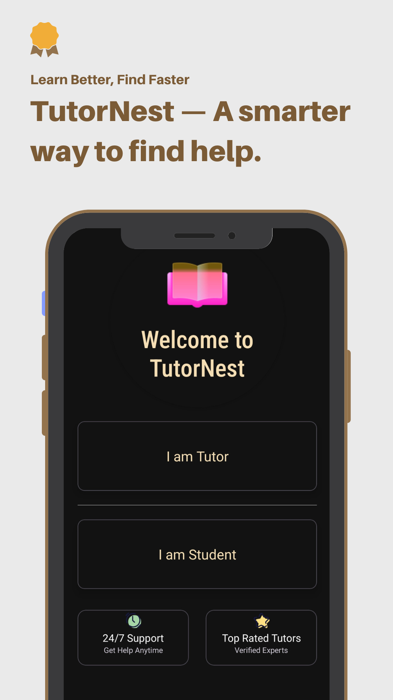
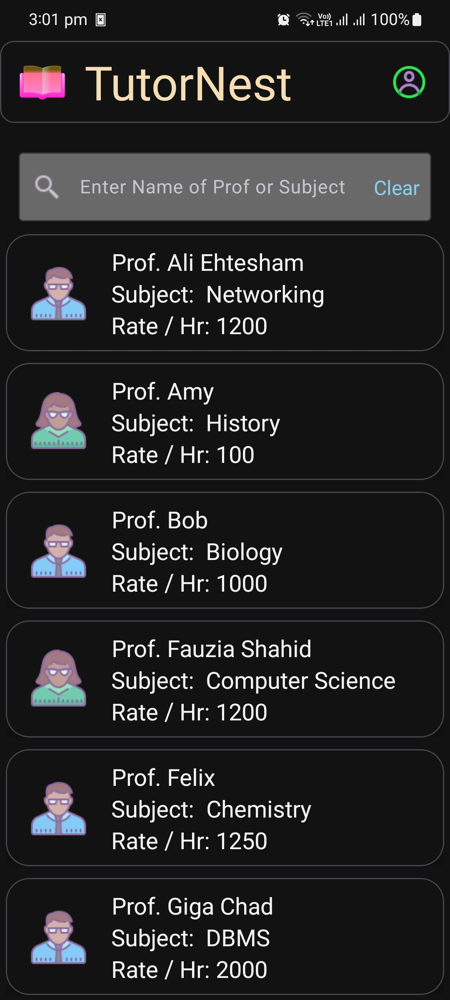
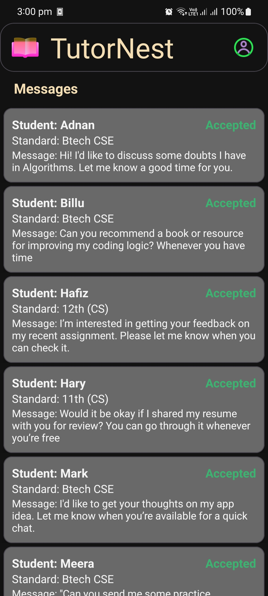
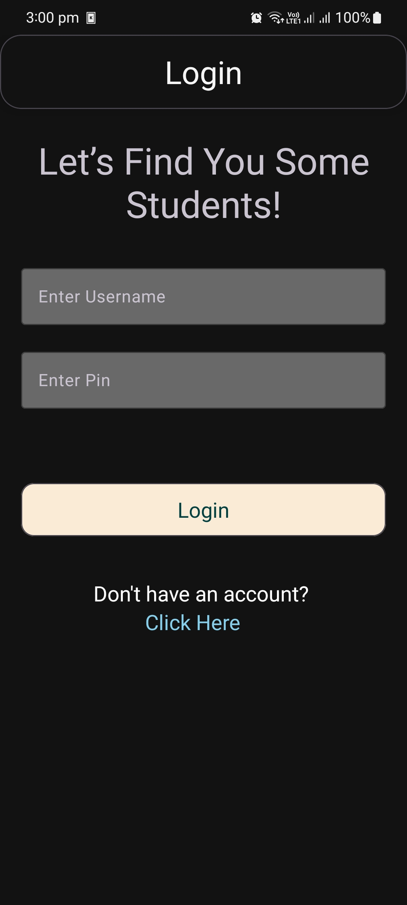
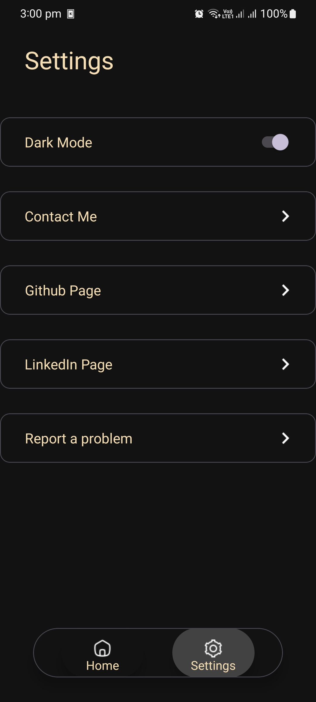

# 📚 TutorNest - Your Personal Tutor Finder App

TutorNest is an Android application that connects students with qualified private tutors. Designed for seamless communication, personalized matching, and ease of use — it bridges the gap between learners and educators.

---

## ✨ Features

👨‍🏫 **Tutor Module**
- Tutor signup/login with personal & professional details
- Profile creation with subject, standard, rate, and experience
- View student booking requests with message content

🎓 **Student Module**
- Student signup/login with class/standard details
- Browse tutor profiles based on subjects and experience
- Send personalized booking requests to tutors
- View all previous booking requests

📞 **Communication**
- Contact tutor via phone or email directly from the app

🧠 **User Experience**
- Intuitive UI with smooth transitions
- Role-based login with saved sessions (SharedPreferences)
- Custom CardView animations and blur overlays

---

## 🛠️ Tech Stack

| Category       | Tech Used                        |
|----------------|----------------------------------|
| Language       | Java                             |
| UI             | XML + Material Components        |
| Architecture   | Activity-based                   |
| Backend        | Firebase Realtime Database       |
| Data Storage   | Firebase                         |
| Libraries      | Firebase SDK, AndroidX, Material |

---

## 📱 Screenshots

## 📱 Screenshots

<h4>🔹 Front Page</h4>
<p align="center">
  
</p>

<h4>🔹 List of Tutors</h4>
<p align="center">
  
</p>

<h4>🔹 Tutor Activity Screen</h4>
<p align="center">
  
</p>

<h4>🔹 Login / Signup Screen</h4>
<p align="center">
  
</p>

<h4>🔹 Settings Screen</h4>
<p align="center">
  
</p>


---

## 🚀 Getting Started

To build and run this project locally:

1. Clone the repo
   ```bash
   git clone https://github.com/WhyAdnanShah/TutorNest.git
